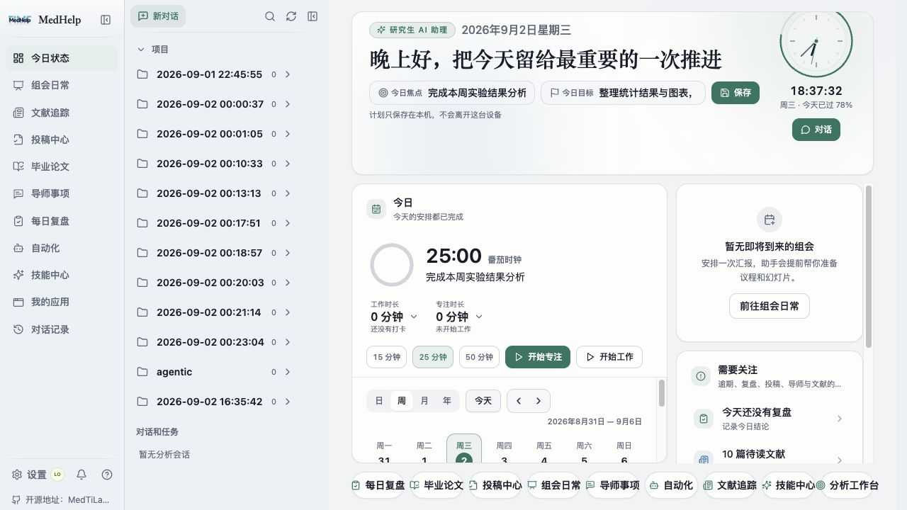
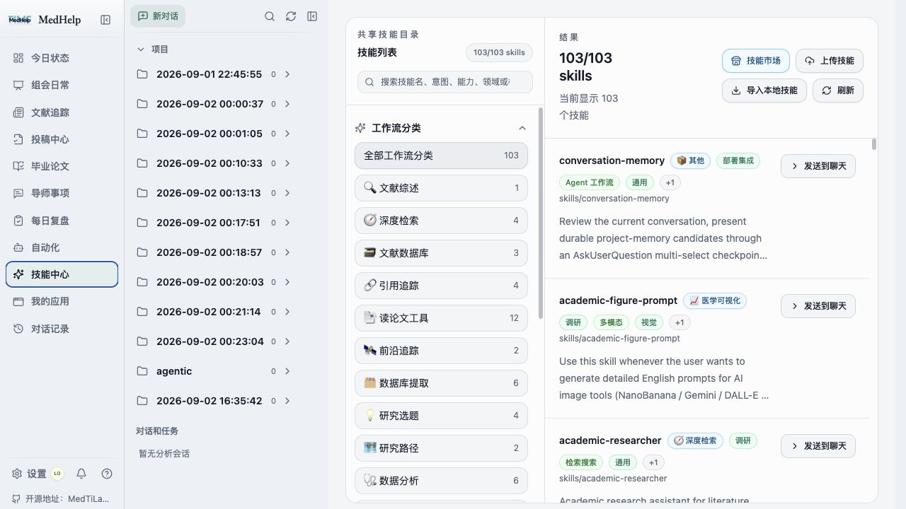
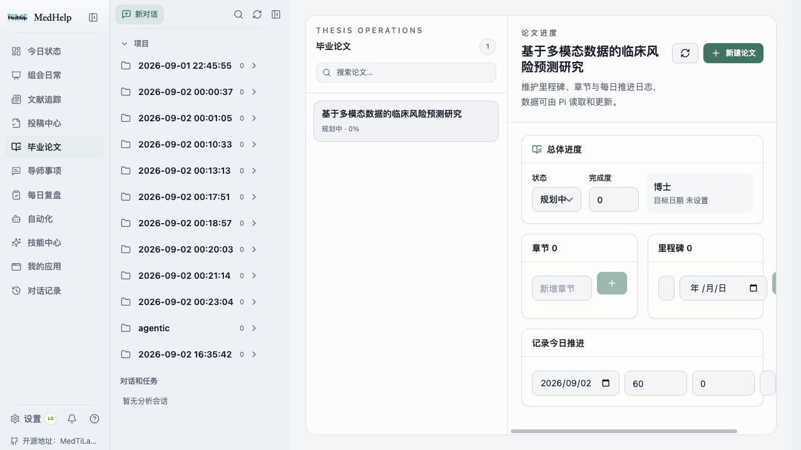

# Research Assistant（MedHelp）

> 你的研究生 AI 助理：把科研对话、项目材料、组会、论文、导师反馈、每日复盘和自动化放进同一个工作台。

Research Assistant 是一个面向研究生和科研人员的开源 AI 科研工作区。当前版本以“科研秘书”为核心，不要求项目遵循固定研究阶段，而是围绕真实日常工作持续整理上下文、跟踪事项并推进交付。

- 当前版本：`0.1.1`
- 界面名称：`MedHelp`
- npm 包名：`medhelpsec`
- 开源仓库：<https://github.com/MedTiLab/Research-Assistant>

## 界面预览

### 科研秘书工作台



左侧集中访问科研秘书功能，中间保留项目、对话与任务上下文，右侧展示今日焦点、专注记录、日历和待处理事项。

### 科研技能中心



按科研工作流浏览和检索可复用技能，并将选定技能直接发送到 Agent 对话中使用。

### 毕业论文进度



统一管理毕业论文章节、里程碑、完成度和每日推进记录。

## 当前功能

### 科研秘书工作台

- **跨项目总览**：集中查看研究项目、近期事项、截止日期和工作状态。
- **组会闭环**：管理会议、录音与转写、纪要草稿、行动项及后续跟进。
- **论文投稿**：跟踪稿件、投稿状态、返修任务和关键日期。
- **学位论文**：维护论文章节、里程碑、进度记录和待完成事项。
- **导师事项**：记录导师反馈、行动项、负责人和截止时间。
- **每日复盘**：整理当天状态、工作记录、专注记录和习惯完成情况。
- **科研自动化**：创建和管理科研秘书自动化，查看执行状态与运行历史。

### 项目与 AI 协作

- 在项目上下文中进行 Agent 对话，并保留会话记录。
- 浏览、预览和编辑项目文件，将选定文件作为对话上下文。
- 管理任务、会话上下文、项目记忆和生成产物。
- 通过设置页配置模型提供方、运行时和本地计算资源。
- 支持账户级会话归档，并在不同项目间继续工作。

### 科研技能

- 内置可复用科研技能，覆盖文献、数据、统计、可视化、论文与汇报等任务。
- 支持按科研工作流浏览和检索技能，并将选定技能发送到 Agent 对话中使用。

## 技术栈

- 前端：React 18、TypeScript、Vite、Tailwind CSS
- 后端：Node.js、Express、WebSocket、SQLite / better-sqlite3
- Agent 与工具：Pi runtime、MCP
- 测试：Vitest、Node Test、Playwright

## 快速开始

### 环境要求

- Git
- Node.js `20.x`、`22.x` 或 `24.x`
- npm

部分本地 Agent 和文档解析能力可能需要 Python、系统编译工具或对应的模型运行时。安装脚本会检查项目所需的原生依赖。

### 安装与启动

```bash
git clone git@github.com:MedTiLab/Research-Assistant.git
cd Research-Assistant
npm install
npm run dev
```

`npm run dev` 会同时启动后端和 Vite 开发服务器。启动后打开终端中显示的本地地址。

如果需要自定义端口、数据路径或服务端配置，可以复制环境变量模板：

```bash
cp .env.example .env
```

`.env.example` 只包含配置说明和占位项。请勿把真实 API 密钥、访问令牌或生产环境密钥提交到 Git。

### 生产构建

```bash
npm run build
npm run server
```

也可以一次完成构建和启动：

```bash
npm start
```

## 常用开发命令

```bash
# TypeScript 类型检查
npm run typecheck

# 运行测试
npm test

# 监听测试
npm run test:watch

# 构建前端
npm run build
```

## 项目结构

```text
Research-Assistant/
├── src/          # React 前端与科研秘书功能
├── server/       # API、Agent 会话、数据存储与后台服务
├── shared/       # 前后端共享类型与规则
├── skills/       # 内置科研技能
├── scripts/      # 构建、运行时准备与打包脚本
├── public/       # 静态资源和应用图标
└── test/         # 与当前功能相关的集成测试
```

## 数据与安全

- `.env`、本地数据库、运行时数据、构建产物和测试输出均由 `.gitignore` 排除。
- 仓库只保留 `.env.example`，其中不应填写真实凭据。
- 模型密钥和第三方服务凭据应通过本地环境或应用设置保存。
- 开源前请再次检查提交内容，避免上传个人项目数据、绝对路径、访问令牌或私有研究材料。
- 对访问受限数据、患者数据和其他敏感研究资料，请遵守数据使用协议和所在机构要求。

## 开源与贡献

问题反馈和代码贡献请通过 GitHub Issues 与 Pull Requests 提交：

<https://github.com/MedTiLab/Research-Assistant>

## 许可

本项目包含 GPL-3.0 与 AGPL-3.0 许可范围内的代码。具体版权、上游来源和适用条款请参见 [`LICENSE`](LICENSE) 与 [`NOTICE`](NOTICE)。
